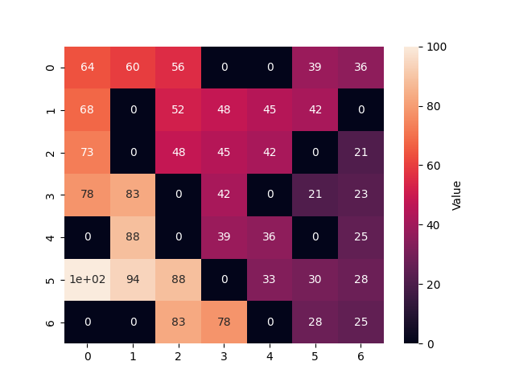
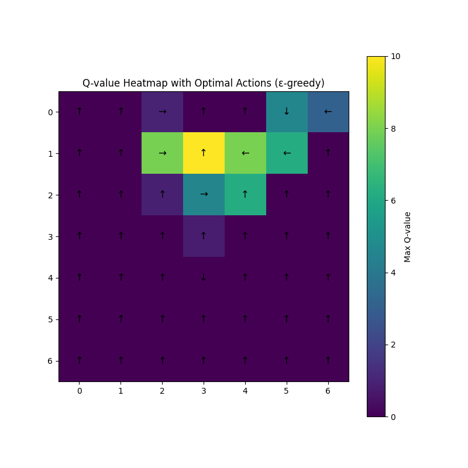
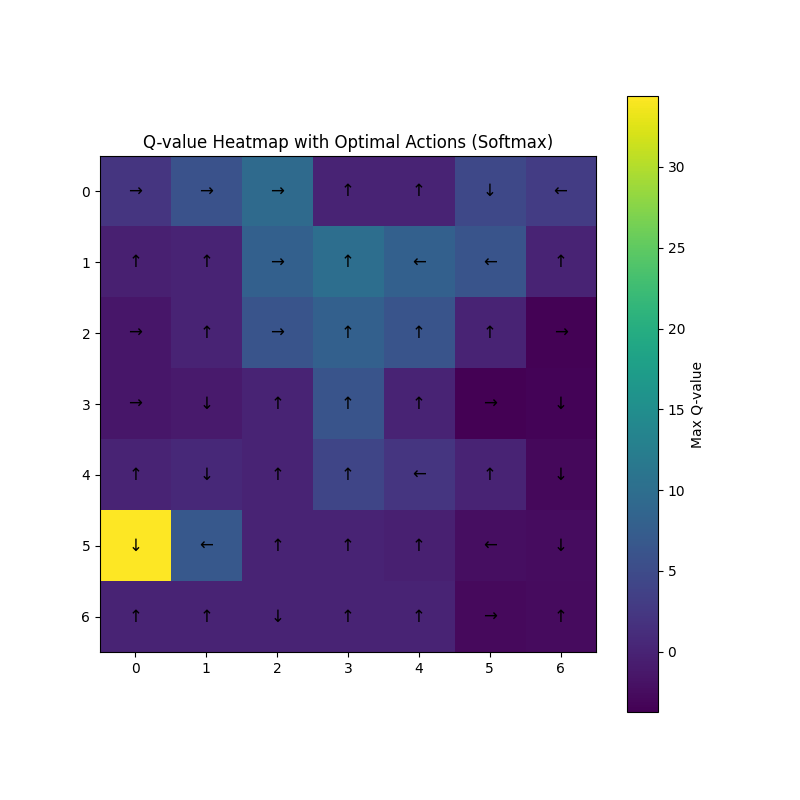
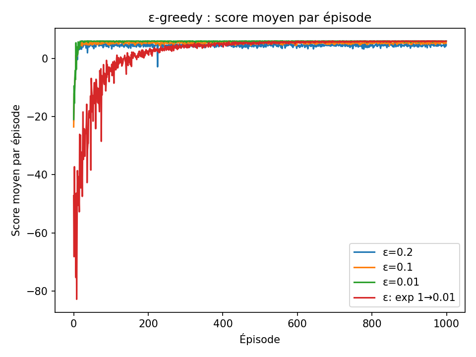
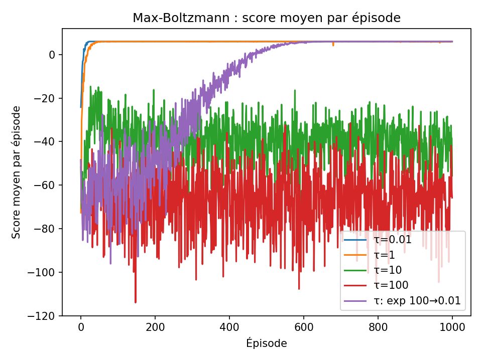

# Reinforcement_Learning

## Overview
This project explores **Reinforcement Learning (RL)** through two approaches:  
- **Value Iteration**: a model-based algorithm relying on the Bellman equation.  
- **Q-Learning**: a model-free algorithm that learns directly from interactions.  

The environment is a **7×7 maze** where the agent must reach an exit while maximizing rewards.  
We compare both approaches, analyze the role of exploration, and study the sensitivity to parameters like:  
- Discount factor ($\gamma$)  
- Learning rate ($\alpha$)  
- Environment randomness probability ($p$)  

---

## Methodology
- **Environment**:  
  - Two terminal states (exits) with positive rewards (10 for top exit, 100 for bottom-left exit).  
  - Step cost of `-1` to encourage shortest paths.  
  - Randomness parameter $p$ introduces non-determinism.  

- **Algorithms**:  
  - *Value Iteration*: iteratively updates state values until convergence.  
  - *Q-Learning*: updates a $Q(s,a)$ table from experience, using two exploration strategies:  
    - $\varepsilon$-greedy  
    - Softmax (Max-Boltzmann)  

- **Training Parameters**:  
  - Episodes: 1000 (20 runs averaged)  
  - $\gamma = 0.9$  
  - $\alpha = 0.1$  
  - Exploration: fixed/decaying $\varepsilon$ and $\tau$  

---

## Results
- **Value Iteration** converges quickly and is robust to randomness.
  
  
*Heatmap of state values obtained by Value Iteration.*
- **Q-Learning** adapts better to stochastic environments but needs more episodes.

  
  

 

- Exploration strategies matter:  
  - A **decaying $\varepsilon$** improves learning efficiency.
   

  - A well-chosen **$\tau$** balances exploration and exploitation.
   

---

## Conclusion
- **Value Iteration**: deterministic, converges fast in non-stochastic settings.  
- **Q-Learning**: more flexible, handles randomness but less stable.  
- Exploration strategy is crucial: balancing exploration vs. exploitation leads to optimal policies.  

---

## Files
- [RL/env.py](RL/env.py) → Maze environment
- [RL/qlearning.py](RL/qlearning.py) → Q-Learning implementation
- [RL/value_iteration.py](RL/value_iteration.py) → Value Iteration implementation
- [Reinforcement_Learning_report.pdf](Reinforcement_Learning_report.pdf) → Full report
- [report_figures](report_figures) → figure and graphes from the report 
